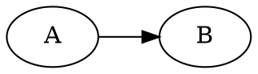

# Additional Markdown test file

Test various other Markdown syntax here.

## Relative file link

See basic syntax [here](markdown-basic.md), and extended syntax [here](markdown-extended.md)!

## Math

Let's define the Normal distribution $N(x; \mu, \sigma^2)$ as follows.

$$
N(x; \mu, \sigma^2) = \frac{1}{\sqrt{2 \pi \sigma^2}} \cdot \exp\left(-\frac{\left(x - \mu\right)^2}{\sigma^2}\right)
$$

## Graphviz/Dot

## \<kbd> tag

While not a markdown syntax, this has a default style:

Press <kbd>Ctrl</kbd> + <kbd>C</kbd> to copy, and <kbd>Ctrl</kbd> + <kbd>V</kbd> to paste!

## Custom attributes

This paragraph has a red background color.{style=background-color:red}

## Github alert blockquote

> [!NOTE]  
> Something to take into account

> [!TIP]
> Did you know you can do this and that

> [!IMPORTANT]  
> Crucial information here

> [!WARNING]  
> Critical content demanding immediate attention

> [!CAUTION]
> Do not do this and that!
