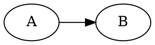

# Extended Markdown test file

Use this file to test extended Markdown rendering capabilities.

## Definition list

dog
    : a domesticated canid
    : a clamp binding together two timbers
    : an utter failure; flop

cat
    : a small domesticated carnivore
    : a devotee of jazz
    : a movable shelter for providing protection when approaching a fortification

Paragraphs in definition:

term
    
:   This is the first paragraph.

    This is the second paragraph. Lorem ipsum dolor sit amet, consectetur adipiscing elit. Sed congue egestas est at maximus. Ut blandit ligula nec iaculis dignissim. Duis ut diam nibh. Curabitur sed consectetur lacus. Integer fringilla metus quis justo condimentum iaculis. Vivamus arcu metus, luctus id posuere eget, rutrum eu neque. Donec a lectus mauris. Etiam magna eros, commodo ut lectus id, finibus sodales est. Suspendisse quis rhoncus purus.

    Hello from the third paragraph!

There's no markdown syntax for this, but technically multiple terms for one definition are allowed:

<dl>
    <dt>Firefox</dt>
    <dt>Mozilla Firefox</dt>
    <dt>Fx</dt>
    <dd>A free, open source, cross-platform, graphical web browser
        developed by the Mozilla Corporation and hundreds of volunteers.</dd>
</dl>

## Emoji

[Complete list of github emoji](https://github.com/ikatyang/emoji-cheat-sheet/blob/master/README.md)

Gone camping! :tent: Be back soon.

That is so funny! :joy:

:cowboy_hat_face::nerd_face:

## kbd tag

While not a markdown syntax, this has a default style:

Press <kbd>Ctrl</kbd> + <kbd>C</kbd> to copy, and <kbd>Ctrl</kbd> + <kbd>V</kbd> to paste!

## Math

Let's define the Normal distribution $N(x; \mu, \sigma^2)$ as follows.

$$
N(x; \mu, \sigma^2) = \frac{1}{\sqrt{2 \pi \sigma^2}} \cdot \exp\left(-\frac{\left(x - \mu\right)^2}{\sigma^2}\right)
$$

## Graphviz/Dot

## Task lists

- [x] completed
- [ ] not completed

## Footnote

Here's a simple footnote,[^1] and here's a longer one.[^bignote]

[^1]: This is the first footnote.

[^bignote]: Here's one with multiple paragraphs and code.

    Indent paragraphs to include them in the footnote.

    `{ my code }`

    Add as many paragraphs as you like.
