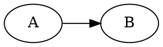
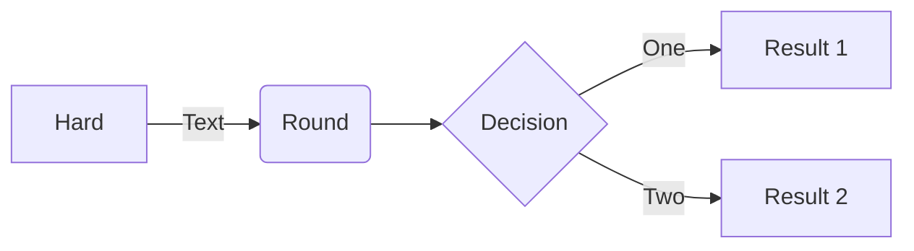

# Additional Markdown test file

Test various other Markdown syntax here, starting with the table of contents

[[toc]]

## Relative file link

See basic syntax [here](markdown-basic.md), and extended syntax [here](markdown-extended.md)!

### Wiki links

With the syntax `[[relative-file]]` we can also link to other files with an
implicit `.md`, e.g. to [[markdown-basic]], or also to any file with explicit
extensions like [[markdown-basic.md]]

## Math

Let's define the Normal distribution $N(x; \mu, \sigma^2)$ as follows.

$$
N(x; \mu, \sigma^2) = \frac{1}{\sqrt{2 \pi \sigma^2}} \cdot \exp\left(-\frac{\left(x - \mu\right)^2}{\sigma^2}\right)
$$

## Graphviz/Dot

## Mermaid

## kbd tag

While not a markdown syntax, this has a default style:

Press <kbd>Ctrl</kbd> + <kbd>C</kbd> to copy, and <kbd>Ctrl</kbd> + <kbd>V</kbd> to paste!

## Custom attribute

This paragraph has a red background color.{style=background-color:red}

## Alerts

Known by many names: GitHub Alerts, Obsidian Callouts, Admonitions...

### The 5 default GitHub style alerts

> [!NOTE]
> Something to take into account

> [!TIP]
> Did you know you can do this and that

> [!IMPORTANT]
> Crucial information here

> [!WARNING]
> Critical content demanding immediate attention

> [!CAUTION]
> Do not do this and that!

### With a custom title

> [!TIP] Foo bar
> 'Tip' with a custom title

### Using custom markers ([Obsidian Callout](https://help.obsidian.md/Editing+and+formatting/Callouts) style)

> [!CUSTOM]
> Set custom icon and color for any marker

> [!TIP] Unconfigured custom markers
> Markers fall back to `[!NOTE]` by default, to match Obsidian's default behavior
>
> Optionally, the fallback icon can be set separately as
> `config.alertOptions.fallbackIcon`

> [!fOo baR Baz Qux]
> The marker is case-insensitive and turns into sentence case (first character
> capitalized)

> [!CUSTOM] paY aTtEntiOn
> You can use a custom title with a custom marker as well
>
> A custom title can be capitalized freely
